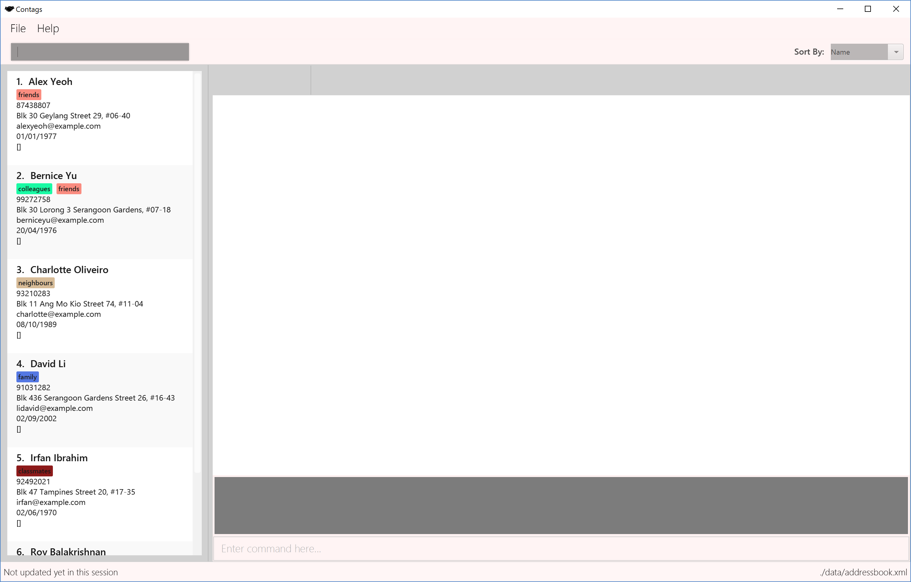

= Contags
ifdef::env-github,env-browser[:relfileprefix: docs/]
ifdef::env-github,env-browser[:outfilesuffix: .adoc]

https://travis-ci.org/CS2103AUG2017-T16-B4/main[image:https://travis-ci.org/CS2103AUG2017-T16-B4/main.svg?branch=master[Build Status]]
https://ci.appveyor.com/project/seankwekjk/main/branch/master[image:https://ci.appveyor.com/api/projects/status/kcg9se29p0a06gm5/branch/master?svg=true[Build Status]]
https://coveralls.io/github/CS2103AUG2017-T16-B4/main?branch=master[image:https://coveralls.io/repos/github/CS2103AUG2017-T16-B4/main/badge.svg?branch=master[Coverage Status]]

ifdef::env-github[]

endif::[]

ifndef::env-github[]
image::images/Ui.png[width="600"]
endif::[]
Have you ever wished that there was some application to store the details of all your contacts easily, with organisation features to easily view details that you need with just some short keyboard commands? +

*_Contags_* does that and more! Come take a look at the unique features that *_Contags_* provides you with to boost your productivity today! +

* This is a desktop Address Book application. It has a GUI but most of the user interactions happen using a CLI (Command Line Interface). +
* It is a Java application intended for you to store details of contacts and access them easily. It also allows you to get directions to the contact's address through the Google Maps feature and allows easy organisation of Contacts through the use of tags, remarks, and sort features. +
* It is *written in OOP fashion*. This allows future developers to come aboard and help to develop Contags with newer and more innovative features to further enhance the productivity of you and other users.

== Site Map

* <<UserGuide#, User Guide>>
* <<DeveloperGuide#, Developer Guide>>
* <<AboutUs#, About Us>>
* <<ContactUs#, Contact Us>>

== Acknowledgements

* Some parts of this application were inspired by the excellent http://code.makery.ch/library/javafx-8-tutorial/[Java FX tutorial] by
_Marco Jakob_.
* This application is a modified version of the sample application https://github.com/se-edu/[AddressBook-Level4] by SE-EDU initiative

== Licence : link:LICENSE[MIT]
